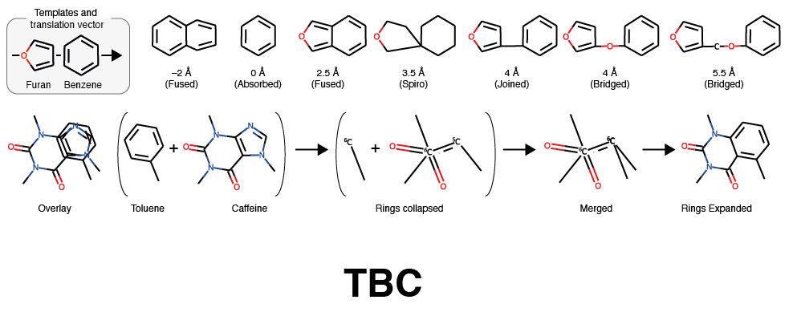
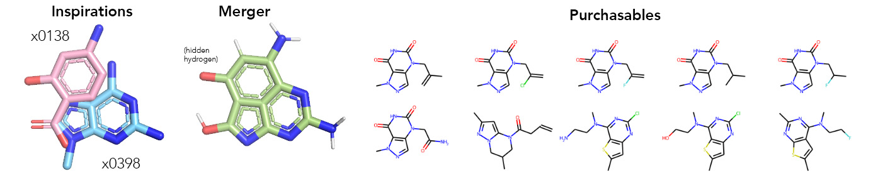
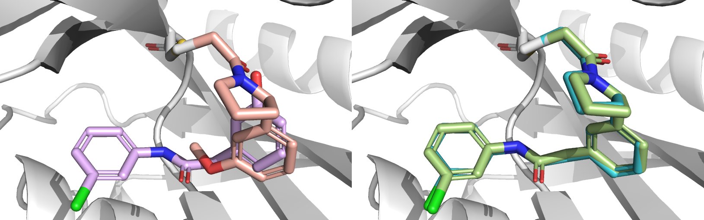
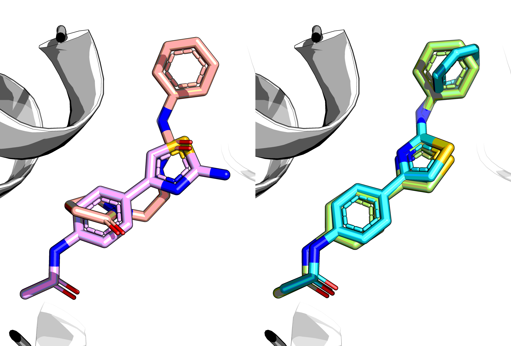

# Fragmenstein-figures
Analyses and figures for the Fragmenstein manuscript (to be revealed later).

> :construction: This repository is still under construction.

This folder contains code to make the figures.
It is not intended for greater dissemination.

For Fragmenstein itself see [repo](https://github.com/matteoferla/Fragmenstein).

### Placement of examples
> See TBA
> 
**Figure 1.** Merging effects based on position.

Workings of Fragmenstein. The molecular "stitching" operations are 
done by the class Monster, which relies on various artifices to work.
A) Translating a superposed furan and benzene by different amounts,
yields different combinations (image shown without minimization).
B) Merging of two superposed molecules is done by collapsing rings and then expanding the merger,
in order to prevent unnecessary distortions. When two atoms occupy the same 2 Å space they are merged.
C) ...

**Figure S1.** Example merger with purchasability issue

### NUDT7
> See [NUDT7 notes](NUDT7/README.md).

In the deposition group G_1002045 are several molecules.

The JACS paper calls `NUOOA000181` `NUDT7-REV-1`, while the ChemMedChem paper calls it `NU181`.
This was merged with `PCM-0102716` to make `NUDT7-COV-1`/`NU443` in the JACS paper.

**Figure 2.** Comparison of crystallised and placed followup from NUDT7 targets

_Comparison of crystallised and placed followup from NUDT7 targets._

The two hits NU181 (in lavender, LHS) and PCM0102716 (puce, LHS) were merged in <paper> yielding the merger NU443.
The crystal structure of NU443 (sky blue, RHS) overlayed with the placement predicted by Fragmenstein (green).
PCM0102716 and NU443 are covalent with Cys73 via a acryloyl warhead._
The RMSD between the placed model and the crystal structure of NU443 is 0.28 Å, 
while the combined RMSD values of the model and the structure against the inspiration hits are 0.65 and 0.61 Å. 
In the placement process the hydroxyl of NU181 was automatically discarded from the mapping 
as it would otherwise impede the mapping of the second hit (PCM0102716) due to the greater proximity of 
the NU181 hydroxyl to the oxygen of the acryloyl warhead of PCM0102716 
rather than to the carbon bonded the benzene ring in PCM0102716.

**Figure S2.** Placement of 442.

_Placed crosslinked NU442 (green), overlaid with crystal structures of NU443 (reacted, blue)
and NU442 (unreacted, red)._

Two enantiomers of the reactive acryloyl followup had been tested by xx et al.
`NU443` has a 2S-pyrrolidine ring and `NU442` has a 2R-pyrrolidine.
The latter, were it reacted, would be `'*CC(=O)N1CCC[C@@H]1c1cccc(CC(=O)Nc2cccc(Cl)c2)c1'`.
The placed reacted NU442 scores 1.1 kcal/mol higher (–9.2 kcal/mol) than the reacted NU443 (–10.3 kcal/mol)
and the SG atom in NU443 is only .3 Å away from where it is in PCM-0102716,
while in NU442 it is .9 Å away. Additionally, the RMSD against the hits went from 0.6 Å to 0.9 Å.
This indicates that this enantiomer is more strained, which appears to be a sufficiently 
large enough obstacle to reactivity that it was detected in the non-reacted form.

**Figure S3.** Placement of bold4 (tubulin)

In https://pubmed.ncbi.nlm.nih.gov/35404502/ is a merger wherein a ring is flipped
and without user intervention it does not map correctly.

## Moonshot placement

> See [moonshot notes](moonshot/README.md).

**Figure 3.** Accuracy of placement of COVID19 MPro1 Moonshot compounds.

Accuracy of placement of COVID19 MPro1 Moonshot compounds. 
Followup compounds in the COVID19 MPro1 Moonshot project which had a stated inspiration (manually adjusted) 
were placed with Fragmenstein and docked with rDock either freely or with pharmacophore constraints. 
The initial dataset contained 100 fragment-inspired compounds, but 23 were discarded 
(because the crystal structure of followup had no overlapping atoms with the inspiration, 
the reactive followup was non-covalent in the crystal structure 
and/or Fragmenstein failed to minimise the followup compound) 
and a further 20 were discarded in the pharmacophore constrained rDock due to failure to dock successfully.
Green rectangle is the region where the RMSD is less than 1 Å.

The crystallised moonshot compounds are highly heterogenous in both efficacy of binding and divergence 
relative to the inspiration hits.
Several highly divergent compounds in the set bind in a completely different manner to the inspiration hits.
Several compounds were inspired by x0434, which is poses a mapping problem as it is near symmetric.
In fact, as the plot is done without any massaging bar for the inspiration cleanup discussed in 
[Fragmenstein docs](https://github.com/matteoferla/Fragmenstein/blob/master/documentation/notes/manual_filtering.md).
As a result there are ostensibly 4 hits which are incorrect by 6+ Å in the Fragmenstein placement,
because the followup was interpreted the wrong way round.

## Footnote: consistent color names
The colours at present are the divergent colo(u)r of Fragmenstein as found in `fragmenstein.branding.divergent_colors`.
The primary colour is #AED882, feijoa, but I'll call it green.
As they are divergent colours, they are not quite the same as crayola colours.
I am calling #48DEE9, sky blue,
#E9B9FF, mauve,
#FFB7AA, lavender.
Mauve is not a common colour (sounds fancy), but it's far from mushroom, orange or coral.
