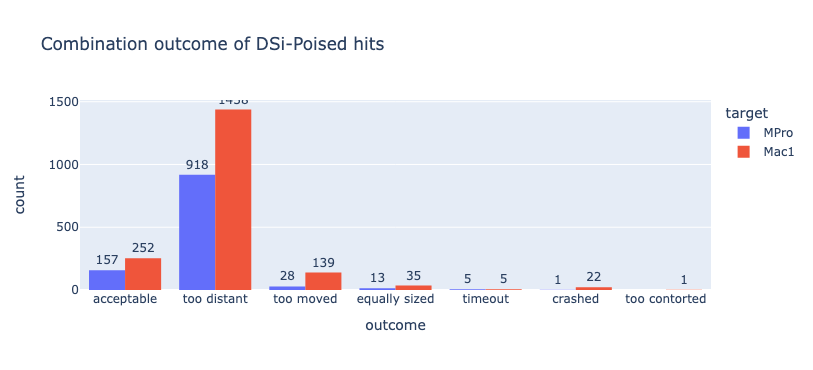

## Benchmarking code

### Extraction
Extraction and generation of demo data done elsewhere, cf.
`fragmenstein.demo.MPro`, `fragmenstein.demo.Mac1`.
I will add a token Fragalysis and/or PDB retrieval cleanup code

### Filter for DSi-Poised
The details of the DSi-Poised library can be found 
on the [Enamine site](https://enamine.net/compound-libraries/fragment-libraries/dsi-poised-library),
the [Diamond XChem site](https://www.diamond.ac.uk/Instruments/Mx/Fragment-Screening/Fragment-Libraries/DSi-Poised-Library.html),
and in [the paper](http://pubs.rsc.org/is/content/articlelanding/2016/sc/c5sc03115j).

This libary contains small fragments that are tailored for expansion.

The following Mac1 hits are derived from that library:

x0091, x0104, x0128, x0142, x0158, x0159, x0173, x0216, x0228, x0253, x0259, x0282, x0299, x0301, x0334, x0371, x0421, x0423, x0436, x0438, x0465, x0469, x0471, x0496, x0516, x0524, x0548, x0548, x0574, x0587, x0591, x0592, x0598, x0600, x0626, x0628, x0655, x0676, x0681, x0685, x0689, x0711, x0722, x0727

While in MPro these are:

x0072, x0104, x0107, x0161, x0165, x0177, x0194, x0195, x0305, x0336, x0354, x0376, x0387, x0390, x0397, x0398, x0425, x0426, x0434, x0464, x0478, x0499, x0540, x0669, x0678, x1077, x1086, x1119, x1132, x1163, x1187, x1226, x1237, x1249

(Any XChem id repetition is coincidental as these are different projects).

Here is the code for the filtering:

```python
# ## Load
import pandas as pd
from rdkit import Chem
from rdkit.Chem import PandasTools
from rdkit.Chem.Draw import IPythonConsole

poised = pd.read_excel('DSiP_Batch-4_Plate1308634_PO8005504_DMSO.xlsx')

PandasTools.AddMoleculeColumnToFrame(poised, 'Smiles','Molecule',includeFingerprints=True)

# ## def fun
from typing import List, Union

class GetRow:
    """
    Given a dataframe with a molecule in ``mol_col``
    return the row is present matching the query hit (of type ``Chem.Mol``).
    Initialisation stores the df and col name,
    while calling the instance with a query hit will return the matching row.
    
    For hits with no bond order, create a new column of the df with no bond order
    see syntenin project.
    """
    def __init__(self, df: pd.DataFrame, mol_col: str):
        self.df = df
        self.mol_col = mol_col
        
    
    def __call__(self, hit: Chem.Mol) -> Union[None, pd.Series]:
        m = (poised.Molecule >= hit)
        if sum(m) == 0:
            return None
        elif sum(m) == 1:
            row = poised.loc[m].reset_index().iloc[0]
        else:
            row = poised.loc[m].sort_values(by="Molecule", key=lambda s: s.apply(Chem.Mol.GetNumHeavyAtoms)).reset_index().iloc[0]
        if hit.GetNumHeavyAtoms() != row.Molecule.GetNumHeavyAtoms():
            return None
        return row
    
    def get_matching_hits(self, hits: List[Chem.Mol]) -> pd.DataFrame:
        rows = []
        for hit in hits:
            row = self(hit)
            if row is None:
                continue
            row['3D_molecule'] = hit
            rows.append(row)
        return pd.DataFrame(rows)
    
# ----------------------------------------------------------------
hits = list(map(Mac1.get_mol, Mac1.get_hit_list()))
poised_hits = GetRow(poised, 'Molecule').get_matching_hits(hits)
with open('mac1_poised.sdf', 'w') as fh, Chem.SDWriter(fh) as w:
    for hit in poised_hits['3D_molecule']:
        w.write(hit)
```

### Combinations
This is the same as the demo notebook.
It was not run as a notebook but as a script though.

```python
import pyrosetta_help as ph
import pyrosetta
from rdkit import Chem
from rdkit.Chem import AllChem, Draw
#from rdkit.Chem.Draw import IPythonConsole
from typing import Sequence
from fragmenstein.demo import Mac1, MPro
import os, logging, re
import pyrosetta, logging
import pandas as pd
from rdkit import Chem
from fragmenstein import Victor, Laboratory

def display_mols(mols: Sequence[Chem.Mol],
                 molsPerRow=5,
                 subImgSize=(150,150),
                 useSVG=True):
    """
    Rudimentary wrapper for calling ``display(Draw.MolsToGridImage``
    """
    flattos = [AllChem.RemoveHs(mol) for mol in mols if isinstance(mol, Chem.Mol)]
    for mol in flattos:
        AllChem.Compute2DCoords(mol)
    display(Draw.MolsToGridImage(flattos,
                         legends=[mol.GetProp('_Name') if mol.HasProp('_Name') else '-' for mol in mols],
                         subImgSize=subImgSize, useSVG=useSVG,
                         molsPerRow=molsPerRow))
    
    

logger = ph.configure_logger()
logger.handlers[0].setLevel(logging.ERROR)  # logging.WARNING = 30
extra_options = ph.make_option_string(no_optH=False,
                                      ex1=None,
                                      ex2=None,
                                      #mute='all',
                                      ignore_unrecognized_res=True,
                                      load_PDB_components=False,
                                      ignore_waters=False)
pyrosetta.init(extra_options=extra_options)

#star = Chem.MolFromSmiles('*')
#hits = list(filter(lambda mol: not mol.HasSubstructMatch(star), map(Mac1.get_mol, Mac1.get_hit_list())))
#len(hits)

print('Start!')

for target, package in [('mac1_poised', Mac1), ('mpro_poised', MPro)]:
    pdbblock = package.get_template()
    with Chem.SDMolSupplier(f'{target}.sdf') as s:
        hits = list(s)

    ranking = '∆∆G' #@param ["LE", "∆∆G", "comRMSD"]
    joining_cutoff:int = 5
    quick_reananimation:bool = True
    covalent_resi:str = '145A'
    covalent_resi = None
    find_similars:bool = True
    topN_to_pick:int = 10
    place_similars:bool = True
    use_originals:bool = False
    output_folder = target

    place_similars: bool = find_similars and place_similars


    if not os.path.exists(output_folder):
        # isnt this done automatically?
        os.mkdir(output_folder)

    Victor.work_path = output_folder
    Victor.monster_throw_on_discard = True  # stop this merger if a fragment cannot be used.
    Victor.monster_joining_cutoff = joining_cutoff  # Å
    Victor.quick_reanimation = quick_reananimation  # for the impatient
    Victor.error_to_catch = Exception  # stop the whole laboratory otherwise
    Victor.enable_stdout(logging.ERROR)
    #Victor.enable_stdout(logging.INFO)
    Victor.enable_logfile(os.path.join(output_folder, f'{target}.log'), logging.ERROR)

    # calculate !
    lab = Laboratory(pdbblock=pdbblock, covalent_resi=covalent_resi)
    n_cores = 28  #@param {type:"integer"}
    combinations:pd.DataFrame = lab.combine(hits, n_cores=n_cores)
    print(combinations.to_pickle(f'{target}_combinations.p'))

print('All Done')
```

### Analysis

```python
import os
import plotly.express as px
import pandas as pd
from rdkit import Chem
from rdkit.Chem import AllChem
from typing import List, Optional, Any, Union
from typing import List, Optional, Any, Dict, Union
import requests, os

# ---------------------------------------

def get_combinations(filename):
    """
    Load the table in filenam and clean up the smiles.
    """
    combinations = pd.read_pickle(filename)
    combinations['clean_smiles'] = combinations.minimized_mol.apply(clean_up).to_list()
    return combinations

def clean_up(mol: Union[Chem.Mol, None]) -> str:
    """
    No to Hs and @@!
    """
    if not isinstance(mol, Chem.Mol):
        return ''
    mol = AllChem.RemoveAllHs(mol)
    try:
        Chem.RemoveStereochemistry(mol)
        AllChem.SanitizeMol(mol)
        return Chem.MolToSmiles(mol)
    except:
        return ''

# ---------------------------------------

class SinglePostera:
    """
    The Posera SDK by Rubén does a lot more,
    this is a simple one aimed at pandas.
    It does log the queries...
    
    """
    # https://api.postera.ai/api/v1/docs/#operation/api_v1_post
    def __init__(self, **options):
        self.options = options
        self.responses = []

    def _post(self, url: str, data: Dict[str, Union[str, float, int]]) -> dict:
        if 'smiles' not in data:
            raise ValueError('no smiles?')
        if not data['smiles'] or not isinstance(data['smiles'], str):
            return {}
        headers = {'X-API-KEY': os.environ["MANIFOLD_API_KEY"]}
        response: requests.Response = requests.post(url, headers=headers, json=data)
        if not response.ok:  # error tolerant
            print(data, response.status_code, response.text)
            return {}
        response_json = response.json()
        results: dict = response_json['results'] if 'results' in response_json else response_json
        self.responses.append((url, data, results))
        return results

    def retrosynthesis(self, smiles) -> dict:
        return self._post('https://api.postera.ai/api/v1/synthetic-accessibility/retrosynthesis/',
                          {'smiles': smiles, **self.options})

    def similarity(self, smiles) -> dict:
        return self._post('https://api.postera.ai/api/v1/similarity/', 
                          {'smiles': smiles, **self.options})

    def fast(self, smiles) -> dict:
        return self._post('https://api.postera.ai/api/v1/synthetic-accessibility/fast-score/', 
                          {'smiles': smiles, **self.options})
    
def extract_vendors(data: List[Dict[str, Any]], flat=False) \
                    -> Union[Dict[str, Dict[str, Union[str, float]]], Dict[str, Any]]:
    # per compound
    vendored = {}

    for mol_info in data:
        for catalogue in mol_info['catalogEntries']:
            if catalogue['catalogName'] in vendored:
                continue
            vendored[catalogue['catalogName']] = dict(similarity=mol_info['similarity'],
                                                      smiles=mol_info['smiles'],
                                                      name=catalogue['catalogId'])
    if not flat:
        return vendored
    return flatten_vendors(vendored)


def flatten_vendors(data: Dict[str, Dict[str, Any]]) -> Dict[str, Any]:
    return {f'{vendor}::{k}': v for vendor in data for k, v in data[vendor].items()}
```

Getting the data:

```python
combinations = pd.DataFrame()
for target in ('MPro', 'Mac1'):
    path = f'{target}_poised_combinations.p'.lower()
    c: pd.DataFrame = get_combinations(path)
    c['target'] = target
    combinations = pd.concat([combinations, c], ignore_index=True)
```
Seeing the outcomes:
```python
px.histogram(combinations.reset_index(), x='outcome', 
             color='target', barmode='group',
             title=f'Combination outcome of DSi-Poised hits')
```


The errors are from the rectification or parameterisation:

```python
combinations.loc[combinations.outcome == 'crashed'].error.to_list()
```

    [,
     'RuntimeError: No sub-structure match found between the probe and query mol',
     "KekulizeException: Can't kekulize mol.  Unkekulized atoms: 3 8 12 13 14",
     'RuntimeError: No sub-structure match found between the probe and query mol',
     'RuntimeError: No sub-structure match found between the probe and query mol',
     'RuntimeError: No sub-structure match found between the probe and query mol',
     'AtomValenceException: Explicit valence for atom # 1 C, 5, is greater than permitted',
     'RuntimeError: No sub-structure match found between the probe and query mol',
     'RuntimeError: No sub-structure match found between the probe and query mol',
     'RuntimeError: No sub-structure match found between the probe and query mol',
     'RuntimeError: No sub-structure match found between the probe and query mol',
     'RuntimeError: No sub-structure match found between the probe and query mol',
     'RuntimeError: No sub-structure match found between the probe and query mol',
     'RuntimeError: No sub-structure match found between the probe and query mol',
     'RuntimeError: No sub-structure match found between the probe and query mol',
     "KekulizeException: Can't kekulize mol.  Unkekulized atoms: 14 15 18 20 21",
     'RuntimeError: No sub-structure match found between the probe and query mol',
     'ValueError: Bad Conformer Id',
     "KekulizeException: Can't kekulize mol.  Unkekulized atoms: 3 4 6 9 10",
     'RuntimeError: No sub-structure match found between the probe and query mol',
     'RuntimeError: No sub-structure match found between the probe and query mol',
     "KekulizeException: Can't kekulize mol.  Unkekulized atoms: 8 9 11",
     'RuntimeError: No sub-structure match found between the probe and query mol']
     
 `RuntimeError` happens after the run,
 wherein the bond order fails to be restored. 
 
 While the rest are rectifier errors.