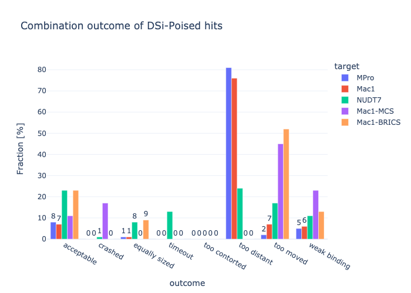

## Benchmarking code

### Extraction
Extraction and generation of demo data done elsewhere, cf.
`fragmenstein.demo.MPro`, `fragmenstein.demo.Mac1`.
I will add a token Fragalysis and/or PDB retrieval cleanup code

### Filter for DSi-Poised
The details of the DSi-Poised library can be found 
on the [Enamine site](https://enamine.net/compound-libraries/fragment-libraries/dsi-poised-library),
the [Diamond XChem site](https://www.diamond.ac.uk/Instruments/Mx/Fragment-Screening/Fragment-Libraries/DSi-Poised-Library.html),
and in [the paper](http://pubs.rsc.org/is/content/articlelanding/2016/sc/c5sc03115j).

This libary contains small fragments that are tailored for expansion.
(Any XChem id repetition is coincidental as these are different projects).

#### Mac1
The following Mac1 hits are derived from that library:

x0091, x0104, x0128, x0142, x0158, x0159, x0173, x0216, x0228, x0253, x0259, x0282, x0299, x0301, x0334, x0371, x0421, x0423, x0436, x0438, x0465, x0469, x0471, x0496, x0516, x0524, x0548, x0548, x0574, x0587, x0591, x0592, x0598, x0600, x0626, x0628, x0655, x0676, x0681, x0685, x0689, x0711, x0722, x0727

#### MPro1
While in MPro these are:

x0072, x0104, x0107, x0161, x0165, x0177, x0194, x0195, x0305, x0336, x0354, x0376, x0387, x0390, x0397, x0398, x0425, x0426, x0434, x0464, x0478, x0499, x0540, x0669, x0678, x1077, x1086, x1119, x1132, x1163, x1187, x1226, x1237, x1249

#### NUDT7

...

#### Code
Here is the code for the filtering:

```python
# ## Load
import pandas as pd
from rdkit import Chem
from rdkit.Chem import PandasTools
from rdkit.Chem.Draw import IPythonConsole

poised = pd.read_excel('DSiP_Batch-4_Plate1308634_PO8005504_DMSO.xlsx')

PandasTools.AddMoleculeColumnToFrame(poised, 'Smiles','Molecule',includeFingerprints=True)

# ## def fun
from typing import List, Union

class GetRow:
    """
    Given a dataframe with a molecule in ``mol_col``
    return the row is present matching the query hit (of type ``Chem.Mol``).
    Initialisation stores the df and col name,
    while calling the instance with a query hit will return the matching row.
    
    For hits with no bond order, create a new column of the df with no bond order
    see syntenin project.
    """
    def __init__(self, df: pd.DataFrame, mol_col: str):
        self.df = df
        self.mol_col = mol_col
        
    
    def __call__(self, hit: Chem.Mol) -> Union[None, pd.Series]:
        m = (poised.Molecule >= hit)
        if sum(m) == 0:
            return None
        elif sum(m) == 1:
            row = poised.loc[m].reset_index().iloc[0]
        else:
            row = poised.loc[m].sort_values(by="Molecule", key=lambda s: s.apply(Chem.Mol.GetNumHeavyAtoms)).reset_index().iloc[0]
        if hit.GetNumHeavyAtoms() != row.Molecule.GetNumHeavyAtoms():
            return None
        return row
    
    def get_matching_hits(self, hits: List[Chem.Mol]) -> pd.DataFrame:
        rows = []
        for hit in hits:
            row = self(hit)
            if row is None:
                continue
            row['3D_molecule'] = hit
            rows.append(row)
        return pd.DataFrame(rows)
    
# ----------------------------------------------------------------
hits = list(map(Mac1.get_mol, Mac1.get_hit_list()))
poised_hits = GetRow(poised, 'Molecule').get_matching_hits(hits)
with open('mac1_poised.sdf', 'w') as fh, Chem.SDWriter(fh) as w:
    for hit in poised_hits['3D_molecule']:
        w.write(hit)
```

### Combinations
This is the same as the demo notebook.
It was not run as a notebook but as a script though.

```python
import pyrosetta_help as ph
import pyrosetta
from rdkit import Chem
from rdkit.Chem import AllChem, Draw
#from rdkit.Chem.Draw import IPythonConsole
from typing import Sequence
from fragmenstein.demo import Mac1, MPro
import os, logging, re
import pyrosetta, logging
import pandas as pd
from rdkit import Chem
from fragmenstein import Victor, Laboratory

def display_mols(mols: Sequence[Chem.Mol],
                 molsPerRow=5,
                 subImgSize=(150,150),
                 useSVG=True):
    """
    Rudimentary wrapper for calling ``display(Draw.MolsToGridImage``
    """
    flattos = [AllChem.RemoveHs(mol) for mol in mols if isinstance(mol, Chem.Mol)]
    for mol in flattos:
        AllChem.Compute2DCoords(mol)
    display(Draw.MolsToGridImage(flattos,
                         legends=[mol.GetProp('_Name') if mol.HasProp('_Name') else '-' for mol in mols],
                         subImgSize=subImgSize, useSVG=useSVG,
                         molsPerRow=molsPerRow))
    
    

logger = ph.configure_logger()
logger.handlers[0].setLevel(logging.ERROR)  # logging.WARNING = 30
extra_options = ph.make_option_string(no_optH=False,
                                      ex1=None,
                                      ex2=None,
                                      #mute='all',
                                      ignore_unrecognized_res=True,
                                      load_PDB_components=False,
                                      ignore_waters=False)
pyrosetta.init(extra_options=extra_options)

#star = Chem.MolFromSmiles('*')
#hits = list(filter(lambda mol: not mol.HasSubstructMatch(star), map(Mac1.get_mol, Mac1.get_hit_list())))
#len(hits)

print('Start!')

for target, package in [('mac1_poised', Mac1), ('mpro_poised', MPro)]:
    pdbblock = package.get_template()
    with Chem.SDMolSupplier(f'{target}.sdf') as s:
        hits = list(s)

    ranking = '∆∆G' #@param ["LE", "∆∆G", "comRMSD"]
    joining_cutoff:int = 5
    quick_reananimation:bool = True
    covalent_resi:str = '145A'
    covalent_resi = None
    find_similars:bool = True
    topN_to_pick:int = 10
    place_similars:bool = True
    use_originals:bool = False
    output_folder = target

    place_similars: bool = find_similars and place_similars


    if not os.path.exists(output_folder):
        # isnt this done automatically?
        os.mkdir(output_folder)

    Victor.work_path = output_folder
    Victor.monster_throw_on_discard = True  # stop this merger if a fragment cannot be used.
    Victor.monster_joining_cutoff = joining_cutoff  # Å
    Victor.quick_reanimation = quick_reananimation  # for the impatient
    Victor.error_to_catch = Exception  # stop the whole laboratory otherwise
    Victor.enable_stdout(logging.ERROR)
    #Victor.enable_stdout(logging.INFO)
    Victor.enable_logfile(os.path.join(output_folder, f'{target}.log'), logging.ERROR)

    # calculate !
    lab = Laboratory(pdbblock=pdbblock, covalent_resi=covalent_resi)
    n_cores = 28  #@param {type:"integer"}
    combinations:pd.DataFrame = lab.combine(hits, n_cores=n_cores)
    print(combinations.to_pickle(f'{target}_combinations.p'))

print('All Done')
```

### Faux Victor

In the submodule `fragalysis.faux_victors` there are Victor alternatives.
With the potential exception of ``Wictor`` (Victor without pyrosetta, i.e. no energy minimization),
the classes ``Mictor`` (Victor with MCSMerger, i.e. no positional info used)
and ``AccountableBRICS`` (nt a Victor, but generates a BRICS decomposition of the hits and returns a dataframe
    with the built molecules usable in ``Laboratory.place``)
are not intended to be used beyond this experiment.

The faux Monster ``MCSMerger`` combines molecules by MCS.
They will get rectified. The first molecule is the source of the contraints for Igor:
the second molecules would otherwise make the merger non-minimisable.

The ``AccountableBRICS`` preparatiory class for ``Laboratory.place``,
merges the compounds by BRICS decomposition but keeps the identity of the hits (hence its name ``Accountable``)
by storing it in the isotopes of the atoms.

```python
import pandas as pd
from fragmenstein import Laboratory
from fragmenstein.faux_victors import Mictor
lab = Laboratory(pdbblock=pdbblock, covalent_resi=None)
lab.Victor = Mictor
combinations: pd.DataFrame = lab.combine(hits, n_cores=28)
combinations.to_pickle(f'Mac1_mcs_combinations.p')
# ------------------------
from fragmenstein.faux_victors import AccountableBRICS
decomposer = AccountableBRICS(hits)
results: pd.DataFrame = decomposer(cutoff=decomposer.median, max_mergers=10_000)
print(decomposer.info)
results['hitz'] = results.hits
# keep only first
results['hits'] = results.hits.apply(lambda hits: [hits[0]])
lab = Laboratory(pdbblock=Mac1.get_template(), covalent_resi=None)
placements:pd.DataFrame = lab.place(results, expand_isomers=False, n_cores=28)
print(placements.to_pickle(f'Mac1_brics_combinations.p'))
```

### Analysis

```python
import os, json
import plotly.express as px
import pandas as pd
from rdkit import Chem
from rdkit.Chem import AllChem
from typing import List, Optional, Any, Union

def clean_up(mol: Union[Chem.Mol, None]) -> str:
    if not isinstance(mol, Chem.Mol):
        return ''
    mol = AllChem.RemoveAllHs(mol)
    try:
        Chem.RemoveStereochemistry(mol)
        AllChem.SanitizeMol(mol)
        return Chem.MolToSmiles(mol)
    except KeyboardInterrupt as key:
        raise key
    except Exception as error:
        if isinstance(error, KeyboardInterrupt):
            raise KeyboardInterrupt
        return ''

def get_combinations(filename):
    combinations = pd.read_pickle(filename)
    combinations['clean_smiles'] = combinations.minimized_mol.apply(clean_up).to_list()
    return combinations
```

Getting the data:

```python
import pandas as pd
import pandera.typing as pdt
from typing import List, Optional, Any, Dict, Union
import requests, os

# -----------------------------------------------

combinations = pd.DataFrame()
for target in ('MPro', 'Mac1', 'NUDT7', 'Mac1-MCS', 'Mac1-BRICS'):
    path = f'{target}_poised_combinations.p'.lower()
    c: pd.DataFrame = get_combinations(path)  # noqa previous cell
    c['target'] = target
    combinations = pd.concat([combinations, c], ignore_index=True)
    
# -----------------------------------------------
    
combinations['LE'] = combinations['∆∆G'] / combinations['minimized_mol'].apply(lambda mol: float('nan') if mol is None else mol.GetNumHeavyAtoms())
combinations.loc[(combinations.outcome == 'acceptable') & (combinations.LE > -0.1), 'outcome'] = 'weak binding'

# -----------------------------------------------
import json, gzip, pickle
from postera import SinglePostera

p = SinglePostera()
# with gzip.open('responses.pkl.gz', 'rb') as fh:
#     p.responses+= pickle.load(r, fh)
sa = combinations.clean_smiles.apply(p.sa_retro)
#sa = combinations.clean_smiles.apply(lambda s: p.dejavu('https://api.postera.ai/api/v1/synthetic-accessibility/retrosynthesis/', {'smiles': s}))
import operator
nan = float('nan')
sa = sa.apply(lambda v: v if isinstance(v, dict) else {'score': nan, 'minNumSteps': nan})

combinations['postera_SAScore'] = sa.apply(operator.itemgetter('score'))
combinations['postera_minNumSteps'] = sa.apply(operator.itemgetter('minNumSteps'))

# -----------------------------------------------

from rdkit.Chem.QED import qed

def safe_qed(mol):
    if isinstance(mol, Chem.Mol):
        return qed(mol)
    return float('nan')

combinations['QED'] = combinations.minimized_mol.apply(safe_qed)

# -----------------------------------------------

pd.pivot_table(combinations, index='target', values='outcome', aggfunc=len)
```

| target     |   outcome |
|:-----------|----------:|
| MPro       |      1122 |
| Mac1       |      1892 |
| Mac1-BRICS |     10000 |
| Mac1-MCS   |      1892 |
| NUDT7      |       600 |

Seeing the outcomes:
```python
fig = px.histogram(combinations.reset_index(), x='outcome', 
             color='target', barmode='group',
             title=f'Combination outcome of DSi-Poised hits')
fig.update_traces(texttemplate='%{y}', textposition='outside')
fig.update_layout(uniformtext_minsize=8, uniformtext_mode='hide')

fig
```


This is rather hard to read as the number for each target differ.

```python
#%%script false --no-raise-error
# pointless long version of above for normalisation to %
tally = combinations.target.value_counts().to_dict()

pivoted = pd.pivot_table(combinations, values='name', index='outcome', columns='target', aggfunc='count').fillna(0).astype(int)
targets = ('MPro', 'Mac1', 'NUDT7', 'Mac1-MCS', 'Mac1-BRICS')
_ = [pd.DataFrame(dict(counts=pivoted[target] / tally[target] * 100, target=target)) for target in targets]
flattened = pd.concat(_)\
              .fillna(0).astype({'counts': int, 'target': str})
fig = px.bar(flattened.reset_index(), x='outcome', y='counts',
             color='target', barmode='group',
             title=f'Combination outcome of DSi-Poised hits')
fig.update_traces(texttemplate='%{y}', textposition='outside')
fig.update_layout(uniformtext_minsize=8, uniformtext_mode='hide', yaxis=dict(title='Fraction [%]'))
fig.update_layout(template="plotly_white",)
fig.write_image('benchmark_outcome.png')
fig
```


The errors are from the rectification or parameterisation:

```python

combinations['error_family'] = combinations.error.apply(Laboratory.error_classify)
combinations['error_family'].value_counts()
```
|                               |   error_family |
|:------------------------------|---------------:|
| success                       |          12519 |
| distance                      |           2504 |
| incorrect rectification #3    |            163 |
| embedding error               |            142 |
| timeout                       |            130 |
| incorrect rectification #2    |             22 |
| incorrect parameterisation #1 |             18 |
| incorrect rectification #4    |              3 |
| incorrect parameterisation #5 |              3 |
| incorrect rectification #1    |              1 |
| incorrect parameterisation #3 |              1 |