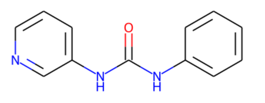
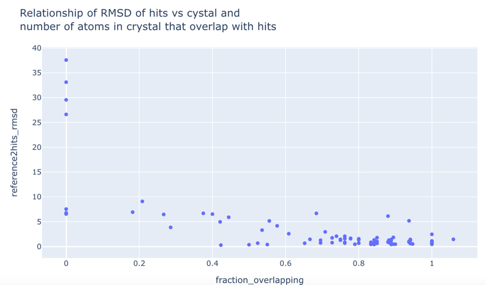

## Moonshot

The manual filtering of the moonshot data is described
[here](https://github.com/matteoferla/Fragmenstein/blob/master/documentation/notes/manual_filtering.md).

## x0434
The prolific hit x0434 is rather troublesome as it is quasi symmetric.


The pyridine ring forms a hydrogen bond to the protein, so luckily
the followups with a pyridine ring will bind that way
however Fragmenstein may be misled: in which case there will be a 7+ Å RMSD
between the Fragmenstein placement and the crystal structure.

For example, EDJ-MED-49816e9b-1 (x11011) was said to be a merger of x0434 and x0678,
but the latter is a red-herring and the superposition of the two fragments results
in Fragmenstein assigning the methyl substituent based on the other ring.

For testing (and classification) I have made two variants of x0434,
where the ureido is substituted by an amide on other side.

```python
from fragmenstein import Monster, mpro_data
x0434 = mpro_data.get_mol('x0434')
monster = Monster([x0434])
smiles = 'O=C(Nc1ccccc1)Cc1cccnc1'
monster.place_smiles(smiles, long_name='x0434-pyri')
x0434_pyri = monster.positioned_mol

smiles = 'O=C(Cc1ccccc1)Nc1cccnc1'
monster.place_smiles(smiles, long_name='x0434-benzo')
x0434_benzo = monster.positioned_mol
monster.to_nglview()
```

However, for the analysis I did not use these,
bar for minor tests... to discover that the couple of outliers are
a case of flipped mapping.


```python
import pandas as pd

data = pd.read_csv('mpro_manual.csv')

from fragmenstein import MProVictor, mpro_data, Igor

Igor.init_pyrosetta()
results = {}
bad = []

for i, row in data.iterrows():
    cid = row.cid
    if cid in bad:
        continue
    if cid in results:
        continue
    print(cid)
    try:
        victor = MProVictor.from_hit_codes(row.inspiration_hits.split(','), category=row.category)
        smiles = mpro_data.get_mol(row.crystal)
        victor.place(row.SMILES, 
                     long_name=row.cid,
                    )
        results[cid] = {**victor.validate(mpro_data.get_mol(row.crystal)),
                        **victor.summarize()}
    except Exception as error:
        print(error)
        bad.append(cid)

# ## parse results
# Unfortunately I overrode a variable with a different type!
results = pd.DataFrame(results).transpose()
results.to_pickle('filtered_moonshot.p')
results
```

## Overlapping

The RMSD of hit to crystal depends on a mapping
which could be wrong.
As a results a further metric is used:
```python
from fragmenstein.monster import GPM

def calc_fraction_overlapping(followup, hits) -> int:
    mapped = {k for hit in hits for k in GPM.get_positional_mapping(followup, hit).keys()}
    return len(mapped)/ followup.GetNumHeavyAtoms()

def clean_name(name):
    return name.replace('_benzo', '').replace('_pyri', '')

def row2overlap(row):
    followup = mpro_data.get_mol(row.crystal_code)
    hit_names = map(clean_name, row.regarded)
    hits = map(mpro_data.get_mol, hit_names)
    return calc_fraction_overlapping(followup, hits)

results['fraction_overlapping'] = results.apply(row2overlap, axis=1)
```
As expecting RMSD and overlap is flat in the high overlap range,
but is bad when the overlap is poor.


This is because several followups are not quite followups and
some bound in a different location than anticipated.

## rDock

Rubén (@rsanchezgarc)  did the rDock analysis of the moonshot data.

Parsing of the sdf file given:

```python
from rdkit.Chem import PandasTools

rdock = PandasTools.LoadSDF('rdock_vs_fragmenstein_summary.sdf', 
                            embedProps=True,
                            molColName='mol', smilesName='smiles')

free_top1 = {}
free_top10 = {}
pharm_top1 = {}
pharm_top10 = {}
old = {}

rdock['SCORE'] = rdock.SCORE.astype(float)
rdock['docking_RMSD'] = rdock.docking_RMSD.astype(float)

for name, named_dock in rdock.groupby('name'):
    nega_mask = named_dock.SCORE < 0
    free = named_dock.loc[(named_dock.docking_type == 'freedocking') & nega_mask]\
                     .sort_values('SCORE')
    pharm = named_dock.loc[(named_dock.docking_type == 'pharm4constrdocking')  & nega_mask]\
                     .sort_values('SCORE')
    free_top1[name] = free.head(1).docking_RMSD.min()
    free_top10[name] = free.head(10).docking_RMSD.min()
    pharm_top1[name] = pharm.head(1).docking_RMSD.min()
    pharm_top10[name] = pharm.head(10).docking_RMSD.min()
    old[name] = free.head(1).fragmenstein_minimised_RMSD.astype(float).min()

# Add to `results`
index_series = results.index.to_series()  # actually this is the same as results['name']
results['rdock_free'] = index_series.map( free_top1 )
results['rdock_free_top10'] = index_series.map( free_top10 )
results['rdock_pharm'] = index_series.map( pharm_top1 )
results['rdock_pharm_top10'] = index_series.map( pharm_top10 )
results['old_RMSD'] = index_series.map( old )
```

## Figure
```python
import plotly.express as px
fig = px.scatter(results.loc[(results.fraction_overlapping > 0.1) & (results['∆∆G'] <= 0)], # 
                 y='reference2minimized_rmsd', 
                 x='rdock_free', 
                 color='fraction_overlapping',
                 color_continuous_scale='Bluered_r',
                 hover_data=['name'],
                 #symbol='based_on_x0434',
                 title='RMSD of Fragmenstein vs. rDock (free)',
                 width=600, height=600
                )
fig.add_shape(type="line",
    x0=0, y0=0, x1=10, y1=10,
    line=dict(
        color="gainsboro",
        width=2,
        dash="dot",
    )
)


fig.update_shapes(dict(xref='x', yref='y'))
fig.add_hrect(y0=0, y1=1, line_width=0, fillcolor="#AED882", opacity=1, layer='below')
fig.add_vrect(x0=0, x1=1, line_width=0, fillcolor="#AED882", opacity=1, layer='below')
fig.update_layout(paper_bgcolor='white', 
                  plot_bgcolor='white',
                 yaxis=dict(gridcolor='gainsboro', 
                            linecolor='darkgrey',
                            title='Fragmenstein RMSD [Å]',
                            range=(0, 10)
                           ),
                 xaxis=dict(gridcolor='gainsboro',
                            linecolor='darkgrey',
                            title='rDock (free) RMSD [Å]',
                            range=(0, 10)
                           ),
                  #legend=dict(orientation='h'),
                  coloraxis_colorbar=dict(title='Fraction of <br>followup atoms <br>overlapping <br>hit atoms')
                 )
#fig.layout.coloraxis.colorbar.orientation='h'
fig.write_image("free.png")
fig.write_image("free.svg")
fig
```
